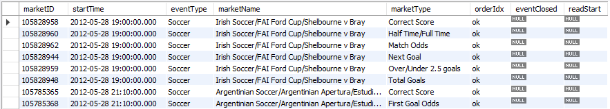
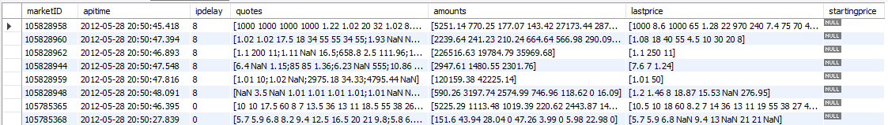
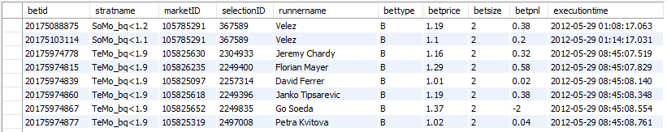

# **MatLab Trading Bot for Sports Betting** :moneybag::dollar:

MatBot is a ready to go trading bot structure written in MatLab for sports betting markets. It provides MatLab classes and utilizes the (old) SOAP API from  (https://www.betfair.com).
The main functions are:
* Runs on client systems as well as on servers and is built for maximum stability and robustness as far as possible within the MatLab Runtime framework which is far more stable than R:computer::rofl:
* All possible errors and warnings are caught and handled, so the bot can accomplish a maximum sytem uptime on servers. Usually the bot can run for many weeks without user interaction
* Employs an infinite loop and regularly reads tick data (every x minutes) from selected types of sports and writes the result to files on disk. The collected files are ready to be regularly transferred to a SQL database (MicroSoft Access and MySQL supported)
* Includes a class (*backt*) with methods for backtesting your strategies against your recorded tick data
* Includes a class (*betmat*) with methods for sports betting mathematics, f.e. calculating overround and dutching, and financial methods, f.e. moving averages and Omega ratio
* Can handle virtual tickets for paper trading your strategies
* MatBot regularly sends you emails via GMail to inform you about its status and trading strategy performance
* You can customize the code so you can run your own strategies and statistics within the main loop
* The market, tick, and ticket data frame structure includes all possible attributes:
  * *Markets*
  * *Ticks*
  * *Tickets*
